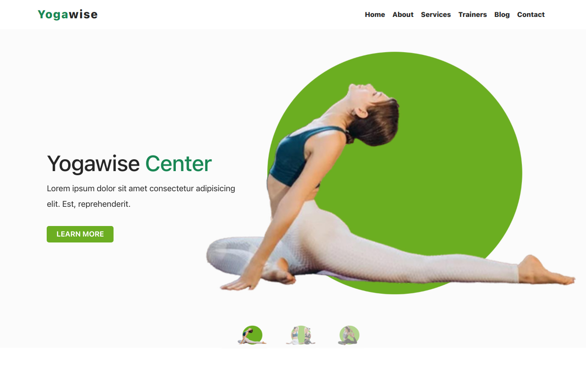

# Yogawise - Yoga and Meditation Website

## Overview

Yogawise is a serene website crafted for yoga and meditation enthusiasts, offering a tranquil space to explore practices and discover resources. The project, built with HTML, CSS, Bootstrap, and JavaScript, brings a responsive and soothing online experience. Notable features include a testimonial auto-slider animated with the Slick animation library, along with a convenient hamburger menu for tab and mobile devices.

### Table of Contents

- [Installation](#installation)
- [Usage](#usage)
- [Technologies Used](#technologies-used)
- [Features](#key-features)
- [Project Structure](#project-structure)
- [Credits](#credits)
- [License](#license)



## Installation

To run this project locally, follow these steps:

1. Clone the repository to your local machine.
    ```bash
    git clone https://github.com/m-ramzan786/Yogawise.git
    ```

2. Open the project folder in your code editor.

3. Open the `index.html` file in your web browser.

## Usage

To explore the Yogawise project:

1. Open the [live demo](https://yogawise.vercel.app/) or run it locally.

2. Immerse yourself in the serene ambiance, navigate through the testimonials, and discover the convenient hamburger menu on mobile devices.

## Technologies Used

- HTML
- CSS (Bootstrap included)
- JavaScript
- Slick Animation Library
- Font Awesome Icons

### Key Features

- **Testimonial Auto-slider:** Engages users with an automated slider showcasing participant testimonials.
  
- **Hamburger Menu:** Enhances mobile user experience with a collapsible menu.

## Project Structure

Yogawise is structured to provide information about yoga and meditation practices, accompanied by participant testimonials for an enriching experience.

## Credits

I would like to acknowledge the following resources and tools that contributed to the success of this project:

- Bootstrap (https://getbootstrap.com/)
- Font Awesome Icons (https://fontawesome.com/)
- Slick Animation Library (https://kenwheeler.github.io/slick/)

## License

This project is licensed under the [MIT License](LICENSE). Feel free to use and modify the code as per the license terms.

---

## Badges


## Feedback and Contributions

If you have any feedback or would like to contribute to the project, follow these steps:

1. Fork the project.
2. Create a new branch for your contribution: `git checkout -b feature-name`.
3. Commit your changes: `git commit -m 'Add new feature'`.
4. Push to the branch: `git push origin feature-name`.
5. Open a pull request.

## Contact

If you have any questions, suggestions, or just want to connect, feel free to reach out:

- Email: [mramzanstv@gmail.com](mramzanstv@gmail.com)
- Portfolio: [Muhammad-Ramzan-Portfolio](https://muhammad-ramzan.vercel.app/)
- LinkedIn: [in/m-ramzan786](https://www.linkedin.com/in/m-ramzan786/)

## Tests

The project includes a set of tests to ensure the functionality is working as expected. To run the tests, use the following command:
```bash
npm test
